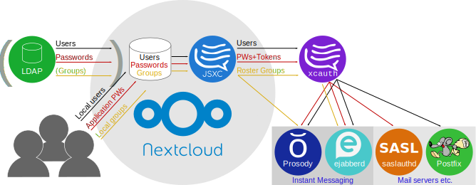

# `xmpp-cloud-auth`: Your authentication hub for Nextcloud, Instant Messaging, and mail

`xmpp-cloud-auth` (aka `xcauth`) started as a simple program to free [JSXC – The Open Chat](https://www.jsxc.org) for [Nextcloud](https://www.nextcloud.com) from having to remember and reuse passwords: The password entered for Nextcloud login would need to be captured and stored in the browser in such a way that malware could also access it.

In the meantime, it has grown to a full authentication hub:

[](./doc/SystemDiagram.svg)

For installation and configuration instructions, see [doc/Installation.md](doc/Installation.md). :warning: Especially if you plan to [use it on *Prosody*](doc/Installation.md#prosody), as their `mod_auth_external.lua` does not work around a bug in `lpty`.

# Code quality

* Build status: [](https://travis-ci.org/jsxc/xmpp-cloud-auth)
* Code coverage (offline-only): [](https://codecov.io/gh/jsxc/xmpp-cloud-auth) (codecov.io unfortunately can't do online tests)
* Code coverage (offline and online tests): [](tests/Coverage.md) (manually updated every few commits)

# Binary repository

To use our binary `deb` repository, create `/etc/apt/sources.list.d/jsxc.list` with the following contents:

```deb
deb https://dl.jsxc.org nightly main
```
